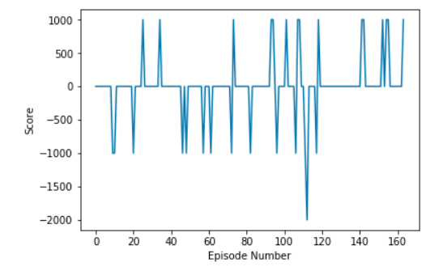

## Q-Learning for Discrete State Grid Navigation Task in Unity Environment

### Model Architecture
Udacity provided the base Q-learning code in PyTorch, and this code was adapted for the Unity Banana agent environment. 

I used Q-Network selection process.  In a simple Q-Table, states are rows of actions and given a state, the highest rewarding action is selected.  The Q-Network has two hidden layers, each containing 64 nodes.  These layers encode the long-term rewards learned (following the Bellman Equation) so that the selected action yields the highest reward.  ReLU is used as the output layer activation function. This architecture improves the performance baseline provided as a starting point for this project.

### Hyperparameters
A learning rate of 5e-4 is used for training for each fully connected layer.  The Tau value is .001, and the Gamma value is .99.  Batch size is 64, and the replay buffer size is 1e5.  These parameters were carried forward from the Deep Q-Network Agent lesson (https://github.com/udacity/deep-reinforcement-learning/blob/master/dqn/exercise/dqn_agent.py).

## Results and Future Work

This model achieves a high-performance score of 50 in about 64 episodes.

The architecture can be improved further.  While viewing the agent's performance, it is not very good.  For example, it gets stuck on the edges.  It also oscillates between discrete control values as it moves diagonally towards the intended target.  Most real-world controls are contineous control systems - but we cover this architecture in the next project.  

I would like to see the solved navigation pixels solution to see how image features can be used to represent spatial relationships.

I would also like to see how Active Learning, a primary research focus of my employment as a machine learning researcher, may provide labeled features that can reduce needed computational training resources. 
