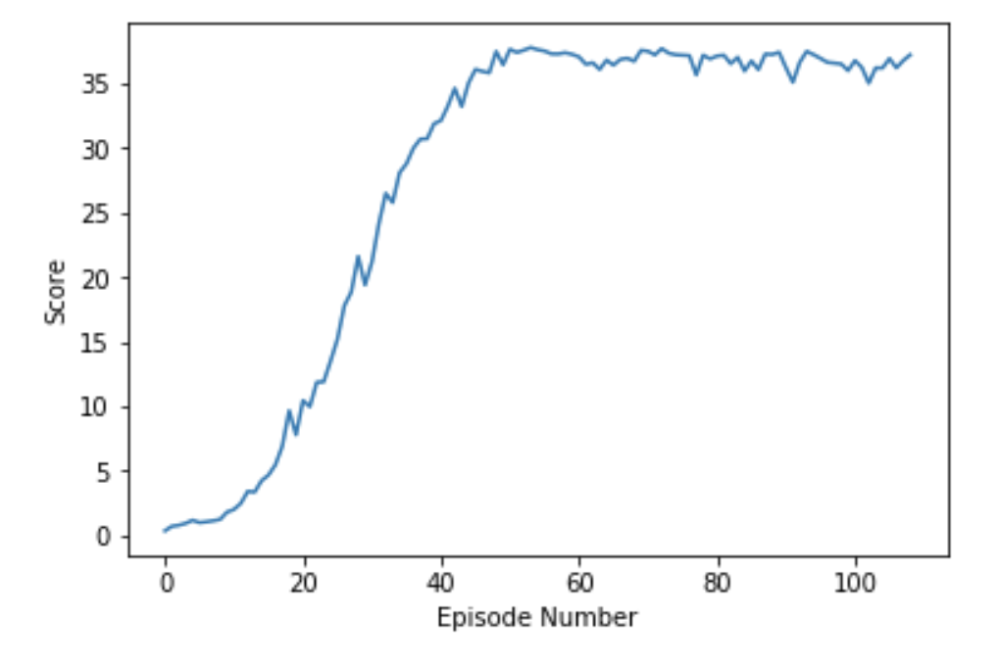

## Deep Deterministic Policy Gradient - Continuous Control Task

[![20 Agent Reacher Environment]
(https://img.youtube.com/vi/ijF98-GBGqo/0.jpg)]
(https://www.youtube.com/watch?v=ijF98-GBGqo)

### Model Architecture
The Udacity provided actor and critic code in PyTorch as well as the noise function.  This code base was adapted for the 20 agent (version 2) environment. 

I used the actor-critic structure with each of the two hidden layers containing 400 and 300 nodes respectively.  ReLU activation is used on the hidden layers and tanh is used for the output layers. This architecture improves on the course's baseline performance provided as a starting point for this project.

### Hyperparameters
A learning rate of 1e-4 was used for each fully connected layer.  Tau value of .001 and Gamma of .99 were also used. Batch size was increased to 128 and the replay buffer size was left at 1e5.  Ornstein-Uhlenbeck noise parameters of 0.15 for Theta and 0.2 for Sigma were also left unchanged. These parameters were carried forward from the Actor-Critic Method lesson (https://github.com/udacity/deep-reinforcement-learning/tree/master/ddpg-bipedal).

## Results and Future Work

This model is able to achieve the the reward performance goal of 30 in about 40 episodes.

Architecture could be researched further.  Specifically, I'd like to use AdaNet (https://arxiv.org/abs/1607.01097) to see what different neural architectures provide performance improvements.  Interestingly, this would be a DRL system building a DRL Contineous Control System.  

Also, increasing the utility of the environment by perhaps increasing to six degrees of freedom + gripper. 

I could further investigate tuning the Ornstein-Uhlenbeck noise level.  These impact the degree of exploration the agent does.  Generally, my treatment of parameters could be improved by adopting recommendations of https://arxiv.org/pdf/1803.09820.pdf.
