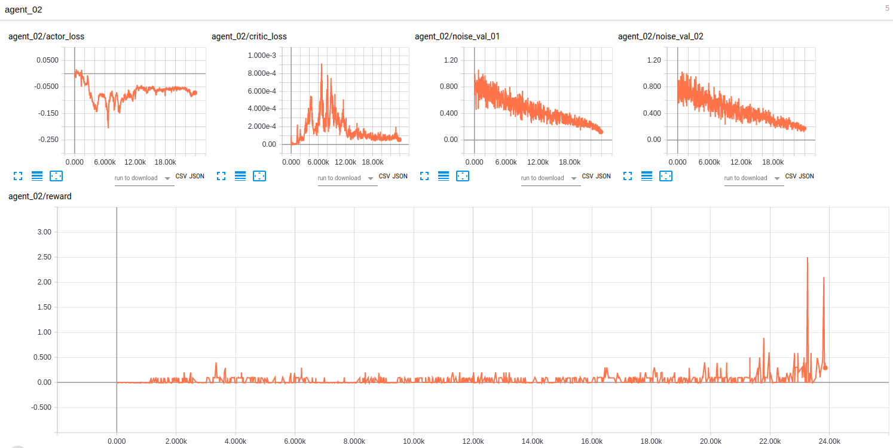

## MultiAgent Deep Deterministic Policy Gradient - Actor-Critic, Continuous Control Task in Unity Tennis Environment

### Model Architecture

The Udacity provided actor and critic code in PyTorch as well as the noise function.  This code base was adapted for the two agent Tennis environment. 

This neural architecture has two DDPG agents (https://arxiv.org/abs/1509.02971) with identical but distinct Actor-Critic models.  The difference between this structure and the prior project is the use of a shared replay buffer for the Critic.  The effect of this implementation is that the Critic has access to both Agent's experience as published in 
Multi-Agent Actor-Critic for Mixed Cooperative-Competitive Environments (https://arxiv.org/abs/1706.02275)  ReLU activation is used on the hidden layers and tanh is used for the output layers. This architecture improves on the course's baseline performance provided as a starting point for this project.

### Hyperparameters
Hyperparameters, I used a larger batch size (256 vs. 64) and a smaller buffer size, 100k vs. 1M; a noise decay of 0.999999 while starting the noise multiplier at 1.1999; while doubling the learning rate of the Actor to  2e-4.   The Actor has two fully connected hidden layers, with 350 and 300 layers, with tanh activated output.  I found that increasing tau by order an order of magnitude, to 1e-2, helped reduce training time and I held Gamma at 0.99.  The Critic's learning rate is 5e-4, and I zeroed the Critic's weight decay.  The Critic has two fully connected hidden layers, each with 350 nodes, using relu activation for both hidden layers.   The given Ornstein-Uhlenbeck noise function parameters of mu=0.0, theta=0.15, and sigma=0.2 are held constant.

## Results and Future Work

This model is able to achieve the the reward performance goal of 0.5 in just under 23,000 episodes.

Architecture could be researched further.  Specifically, I'd like to use as mentioned in the MAACMCCE paper, it would be nice to test an ensemble of policies.  Also, working on limited environment information sharing to Critic would be helpful before attempting the Soccer Environment.  

I could further investigate tuning the Ornstein-Uhlenbeck noise level.  These impact the degree of exploration the agents do.  
